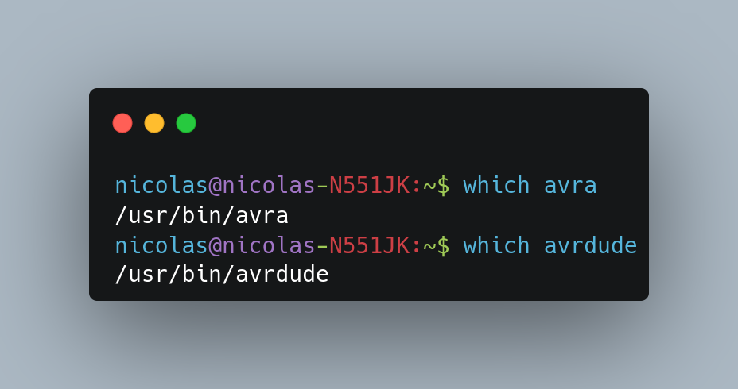
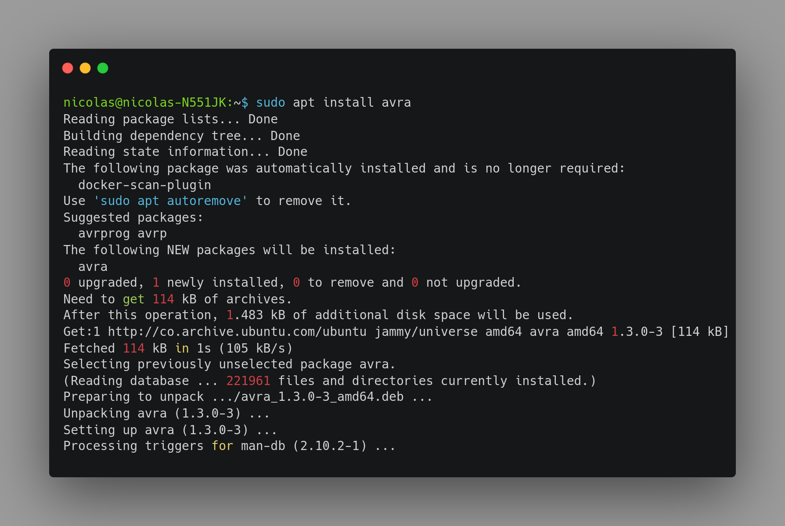
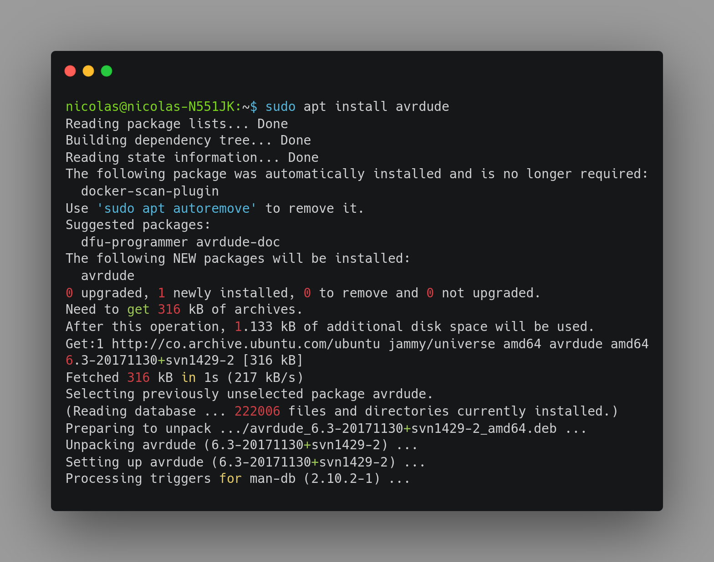
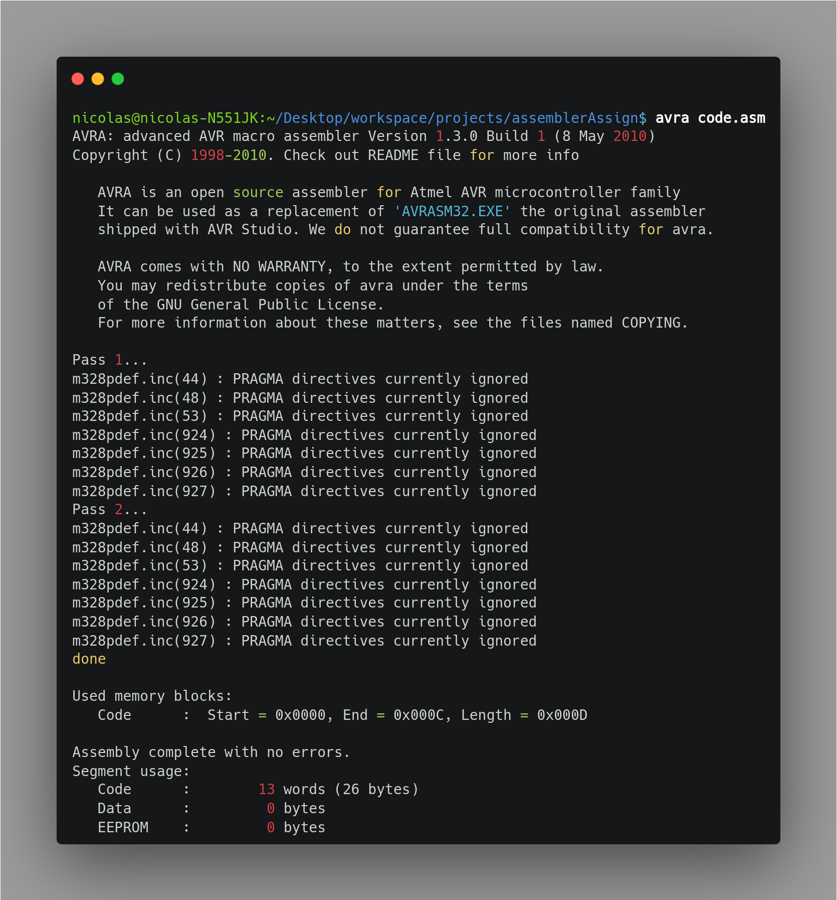
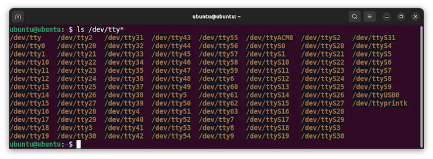
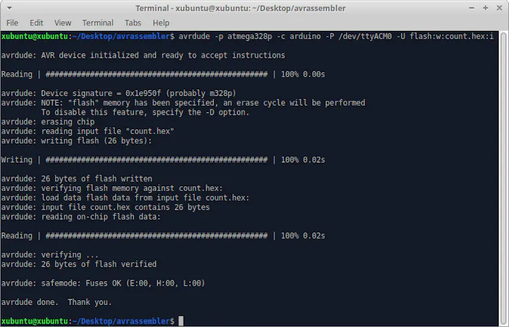

# Assembly program Arduino on Linux with AVRA

Assembly programming of ATmega AVR chips on Windows is done with the avrasm2 assembly program. AVRA is a Linux program.

## Do I have AVRA on my Linux Computer?

Open a terminal window and type `$ which avra` then `$ which avrdude`. The location of the program will be displayed. If the program is not found then no display.



If you need to install avra then type `$ sudo apt install avra`. Your Linux account will need administrator privileges and you probably need a password. If you try to install a program that is already in your computer then no action is performed.



Look at the text and you will see the suggestion to also install avrdude. Type `$ sudo apt install avrdude`. This is the same program used by Arduino IDE so you may already have it.



## Example Assembly Program

> Extension recommended for development in Visual Studio code is [AVR Support](https://marketplace.visualstudio.com/items?itemName=rockcat.avr-support) by rockcat.

Create a new folder for your project. Open a text editor (_vscode_ recommended) and type the following program. Save the files as **code.asm** and **m328pdef.inc** in your project folder.

> **Note:** The file **m328pdef.inc** is an attachment to this project. You can download it and save it in your project folder.
> Download: [m328pdef.inc](m328pdef.inc)

Let's use this program. You can type it with a text editor or download from the attachments to this project.

```assembly
.include "m328pdef.inc"
.def	mask 	= r16	; mask register
.def	ledR 	= r17	; led register
.def	oLoopR 	= r18	; outer loop register
.def	iLoopRl = r24	; inner loop register low
.def	iLoopRh = r25	; inner loop register high
.equ	oVal 	= 80	; outer loop value
.equ	iVal 	= 2000	; inner loop value
.cseg
.org	0x00
clr	ledR		; clear led register to zero
ldi	mask,0xFF	; load the mask register 11111111
out	DDRB,mask	; set PORTB to all 8 bits OUT

start:
out	PORTB,ledR	; write led register to PORTB
inc     ledR		; increment ledR from 0 to 255
ldi     oLoopR,oVal	; initialize outer loop count
oLoop:
ldi    iLoopRl,LOW(iVal)	; intialize inner loop count in inner
ldi    iLoopRh,HIGH(iVal)	; loop high and low registers
iLoop:
sbiw    iLoopRl,1	; decrement inner loop register
brne    iLoop		; branch to iLoop if iLoop register != 0
dec	oLoopR		; decrement outer loop register
brne    oLoop		; branch to oLoop if outer loop register != 0
rjmp    start		; jump back to start
```

Mask is an 8bit number that is all 1's 0b11111111 and it is used to turn all eight pins on PORTB on as outputs. ledR is another 8bit number that increments from 0 to 255 and then repeats. About once a second the sixth bit (PB5 starting from zero) toggles from one to zero then back.

Delays are created by making the processor countdown loops. An outer loop is executed 80 times, each outer loop contains 2000 inner loops. You can speed up or slow down you LED blink by changing either number.

Assembly language contains reserved words that are commands: ldi load immediate, inc increment, dec decrement, etc. Decimal, binary, octal and hexadecimal numbers are all supported and you have to be careful with them.

Words like DDRB and PORTB are not part of the assembly language. We have to define them with a definitions file which lists equivalent values. We add a text document of definitions m328pdef.inc from Atmel that says to substitute the number 0x04 for DDRB and 0x05 for PORTB.

An attachment to this project is a working copy of the definitions file. You can find other copies for this processor and for many more on the web. The filename must be spelled correctly.

## Compile and Upload

### Generate the hex file

Type `$ avra code.asm` on the terminal while in the same directory as the assembler source code and the definitions file.



The assembler will generate a hex file with the same name as the source code. The hex file is the machine code that will be uploaded to the Arduino.

### Upload the hex file with Avrdude

We are going to upload our program to an Arduino Uno board just like the Arduino IDE program. Connect the board to a USB port on the computer and then type `$ ls /dev/tty*`.


Our Arduino Uno is shown as **/dev/ttyACM0**. Unplug the board and repeat the command you will see it disappear from the listing.

**/dev/ttyUSB0** is an Arduino clone board that has a CH340 programmer circuit. Avrdude sees both devices as a `-c arduino` programmer.

Type `$ avrdude -p atmega328p -c arduino -P /dev/ttyACM0 -U flash:w:count.hex:i` the transmit and receive lamps on the Arduino board will blink rapidly during upload. Then the built in LED on the Uno board will blink about once a second.



## Conclusion

The LED built into the Arduino Uno board should be blinking on and off about once a second.
